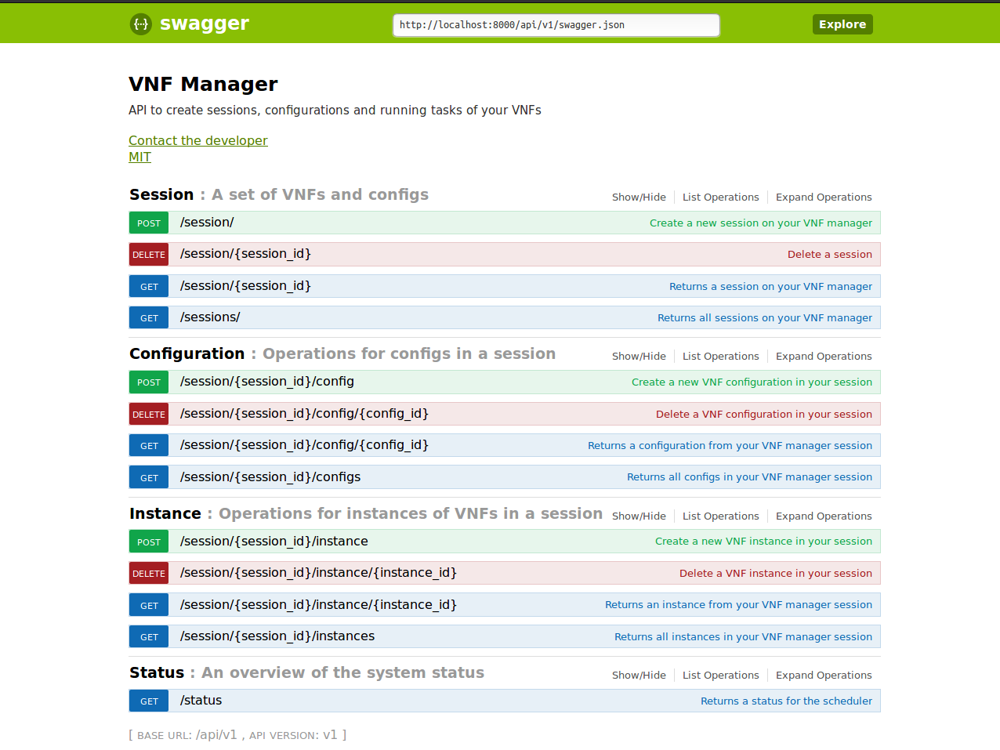

# VNF HTTP rest API

VNF HTTP rest API with basic operations. This VNF is meant for the OAI artefact.

## Operations

The basic operations defined are below
 ```console
GET   /status
POST  /configure
    Headers: "Content-Type: application/json"
    Body: '{
            "param": "value"
          }'
POST  /start
DELETE  /stop/{vnfID}
GET   /status/{vnfID}
 ```

More operations and configuration parameters may come later

## Docker

After building your image, you can run the container as follows (assuming the docker image is vnf:v1):
```sh
 docker run \
        -it \
        --rm \
        -p 8000:1337 \
        -e http_proxy=$http_proxy -e https_proxy=$https_proxy \
        vnf:v1
```
You can then go to your web browser at the url: `http://localhost:8000/api/v1/documentation/` for the API.
If you wan to run the actual VNF, you have to create on your local repo a bin dir that contains the oai vnf, or have it somewhere in your path. Contact me if you have questions about this part.

## Information

More about authors, contribution, and license in the docs


